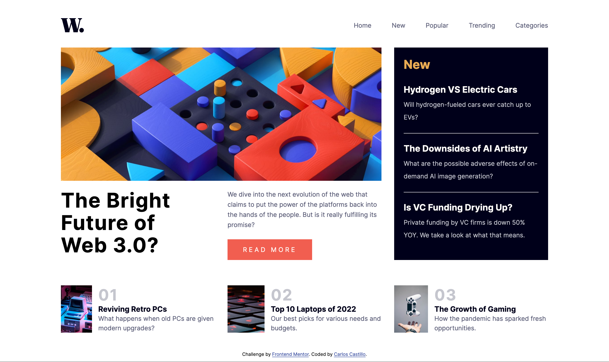

# Frontend Mentor - News homepage solution

This is a solution to the [News homepage challenge on Frontend Mentor](https://www.frontendmentor.io/challenges/news-homepage-H6SWTa1MFl). Frontend Mentor challenges help you improve your coding skills by building realistic projects. 

## Table of contents

- [Overview](#overview)
  - [The challenge](#the-challenge)
  - [Screenshot](#screenshot)
  - [Links](#links)
- [My process](#my-process)
  - [Built with](#built-with)
  - [What I learned](#what-i-learned)
- [Author](#author)

## Overview

### The challenge

Users should be able to:

- View the optimal layout for the interface depending on their device's screen size
- See hover and focus states for all interactive elements on the page
- **Bonus**: Toggle the mobile menu (requires some JavaScript)

### Screenshot

### Links

- Solution URL: [https://www.frontendmentor.io/solutions/news-homepage-Q3LlaCvkzy](https://www.frontendmentor.io/solutions/news-homepage-Q3LlaCvkzy)
- Live Site URL: [https://charliecastleweb.github.io/Front-End-Mentor---News-homepage/](https://charliecastleweb.github.io/Front-End-Mentor---News-homepage/)

## My process

### Built with

- Semantic HTML5 markup
- CSS custom properties
- Flexbox
- CSS Grid
- Mobile-first workflow

### What I learned

Use display grid and burger menu for mobile version

## Author

- Website - [https://carloscastillo.dev/](https://carloscastillo.dev/)
- Frontend Mentor - [@CharlieCastleWeb](hhttps://www.frontendmentor.io/profile/CharlieCastleWeb)
